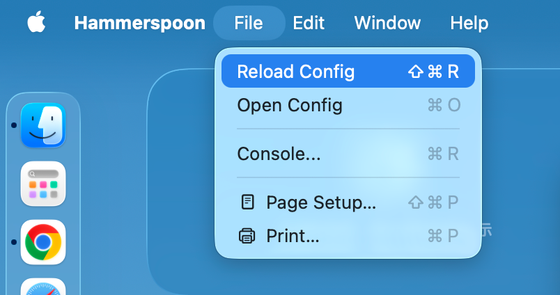

# [Hammerspoon](https://www.hammerspoon.org/)  ➤ MacOS 热键配置


* [**brew**](https://brew.sh/) 安装 [**hammerspoon**](https://www.hammerspoon.org/)
  
  * ```shell
    /bin/bash -c "$(curl -fsSL https://raw.githubusercontent.com/Homebrew/install/HEAD/install.sh)"
    ```
  
  * ```shell
    brew install hammerspoon —cask
    ```
  
* 写入替换  ➤  `~/.hammerspoon/init.lua`

  > 此步骤可以利用自动化脚本 `【MacOS】💉Hammerspoon配置注入.command` 完成
  
  ```lua
  -- ================================== 基础设置 ==================================
  hs.alert.defaultStyle.textSize = 18
  
  local function notify(msg)
    hs.alert.show(msg, 0.6)
  end
  
  local function launch(appName)
    hs.application.launchOrFocus(appName)
  end
  
  local function openPath(path)
    hs.execute('open "' .. path .. '"')
  end
  
  -- ================================== 快捷键：应用启动/切换 ==================================
  -- ⌘1 SourceTree
  hs.hotkey.bind({"cmd"}, "1", function()
    launch("SourceTree")
    notify("SourceTree")
  end)
  
  -- ⌘2 备忘录
  hs.hotkey.bind({"cmd"}, "2", function()
    launch("备忘录") -- macOS 中文名通常可用；若不行改成 "Notes"
    notify("备忘录")
  end)
  
  -- ⌘3 Telegram
  hs.hotkey.bind({"cmd"}, "3", function()
    launch("Telegram")
    notify("Telegram")
  end)
  
  -- ⌘I Google Chrome
  hs.hotkey.bind({"cmd"}, "i", function()
    launch("Google Chrome")
    notify("Google Chrome")
  end)
  
  -- ⌘D 打开下载文件夹
  hs.hotkey.bind({"cmd"}, "d", function()
    openPath(os.getenv("HOME") .. "/Downloads")
    notify("Downloads")
  end)
  
  -- ⌘T 打开终端（默认 Terminal；要 iTerm 改这里）
  hs.hotkey.bind({"cmd"}, "t", function()
    launch("Terminal") -- 改成 "iTerm" / "Warp" / "iTerm2" 视你安装名
    notify("Terminal")
  end)
  
  -- ================================== 热重载（可选但强烈建议） ==================================
  -- ⌘⌥⌃R 重新加载配置
  hs.hotkey.bind({"cmd","alt","ctrl"}, "r", function()
    hs.reload()
  end)
  notify("Hammerspoon 配置已加载 ✅")
  ```
  
* 配置完成后需要进行重启软件或者刷新配置，方可生效

  

