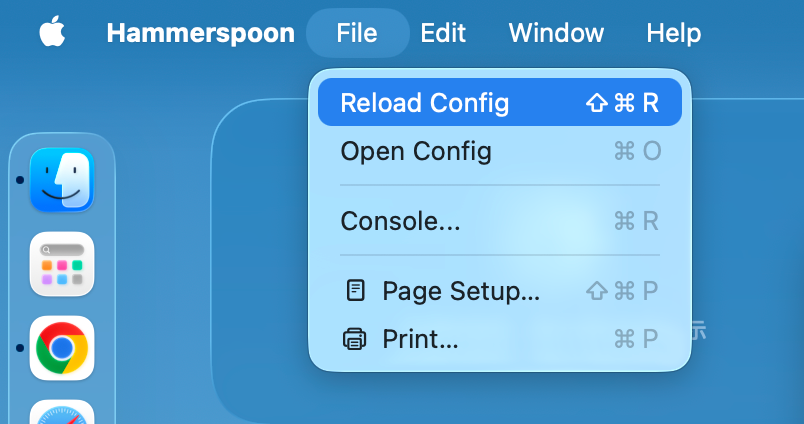
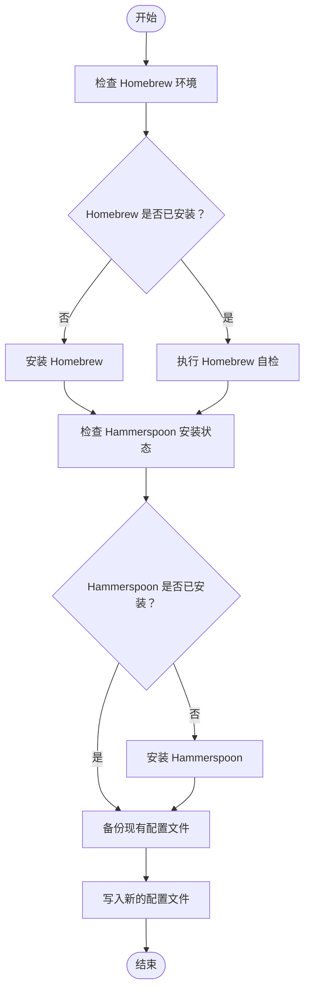

# [**Hammerspoon**](https://www.hammerspoon.org/) 配置 **macOS** 热键


## 一、手动安装步骤

* [**Homebrew**](https://brew.sh/) ➤ [**Hammerspoon**](https://www.hammerspoon.org/)
  * 安装 [**Homebrew**](https://brew.sh/)
    
    ```shell
    /bin/bash -c "$(curl -fsSL https://raw.githubusercontent.com/Homebrew/install/HEAD/install.sh)"
    ```
  * 通过 [**Homebrew**](https://brew.sh/) 的 **cask** 安装 [**Hammerspoon**](https://www.hammerspoon.org/) 图形化界面
    
    ```shell
    brew install --cask hammerspoon
    ```
* 写入替换 ➤ `~/.hammerspoon/init.lua`
* 配置完成后，需要重启 [**Hammerspoon**](https://www.hammerspoon.org/) 或点击 `Reload Config` 刷新配置后才会生效。
  
  

## 二、脚本安装（流程图）


```mermaid
graph TD
    A([开始]) --> B[检查 Homebrew 环境]
    B --> C{Homebrew 是否已安装？}
    C --> |是| D[执行 Homebrew 自检]
    C --> |否| E[安装 Homebrew]
    E --> F[检查 Hammerspoon 安装状态]
    D --> F
    F --> G{Hammerspoon 是否已安装？}
    G --> |是| H[备份现有配置文件]
    G --> |否| I[安装 Hammerspoon]
    I --> H
    H --> J[写入新的配置文件]
    J --> K([结束])
```

## 三、快捷键清单

| 快捷键 | 功能 |
| --- | --- |
| `⌘ + 1` | 打开 / 切换 `SourceTree` |
| `⌘ + 2` | 打开 / 切换「备忘录」 |
| `⌘ + 3` | 打开 / 切换 `Telegram Web` |
| `⌘ + 4` | 打开 / 切换 `LarkSuite` |
| `⌘ + 5` | 打开 / 切换 `Codex` |
| `⌘ + I` | 打开 / 切换 `Google Chrome` |
| `⌘ + Y` | 打开 / 切换「有道词典」 |
| `⌘ + ⇧ + F` | 打开 / 切换 [**Figma**](https://www.figma.com/) |
| `⌘ + D` | 打开 `~/Downloads` 下载文件夹 |
| `⌘ + T` | 打开 `Terminal`；已运行时新建一个终端窗口 |
| `⌥ + Z` | 打开「系统设置」里的「隐私与安全」 |
| `⌘ + ⌥ + ⌃ + R` | 重新加载 [**Hammerspoon**](https://www.hammerspoon.org/) 配置 |

## 四、`⌥ + Z` 隐私与安全快捷键

* `⌥ + Z` 对应 [**Hammerspoon**](https://www.hammerspoon.org/) 里的 `alt + z`，用于快速打开 [**macOS**](https://www.apple.com/macos/)「系统设置」➤「隐私与安全」。
  
  ```lua
  hs.hotkey.bind({"alt"}, "z", function()
    openPrivacySecurity()
    notify("隐私与安全")
  end)
  ```
* 这个快捷键只负责打开目标页面；像「仍要打开」这类安全确认按钮，仍建议手动点击，别做自动化点击。
