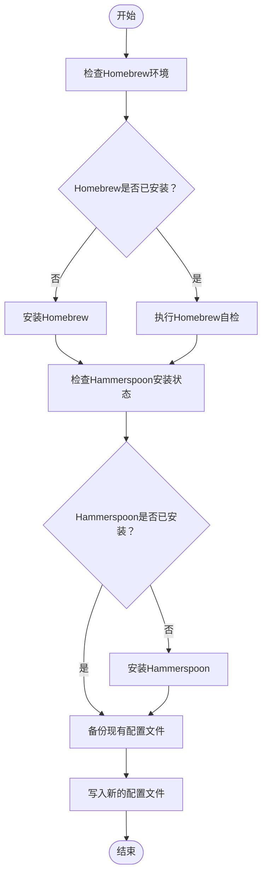

# [Hammerspoon](https://www.hammerspoon.org/) 配置 **MacOS** 热键


## 一、手动安装步骤

* [**Homebrew**](https://brew.sh/) ➤ [**hammerspoon**](https://www.hammerspoon.org/)
  
  * 安装[**Homebrew**](https://brew.sh/) 
    
    ```shell
    /bin/bash -c "$(curl -fsSL https://raw.githubusercontent.com/Homebrew/install/HEAD/install.sh)"
    ```
    
  * 通过[**Homebrew**](https://brew.sh/)的**cask**安装 [**hammerspoon**](https://www.hammerspoon.org/)图形化界面
    
    ```shell
    brew install hammerspoon —cask
    ```
  
* 写入替换  ➤  `~/.hammerspoon/init.lua`

* 配置完成后需要进行重启软件或者刷新配置，方可生效

  
  
## 二、脚本安装（流程图）


```mermaid
graph TD
    A([开始]) --> B[检查Homebrew环境]
    B --> C{Homebrew是否已安装？}
    C --> |是| D[执行Homebrew自检]
    C --> |否| E[安装Homebrew]
    E --> F[检查Hammerspoon安装状态]
    D --> F
    F --> G{Hammerspoon是否已安装？}
    G --> |是| H[备份现有配置文件]
    G --> |否| I[安装Hammerspoon]
    I --> H
    H --> J[写入新的配置文件]
    J --> K([结束])
```


